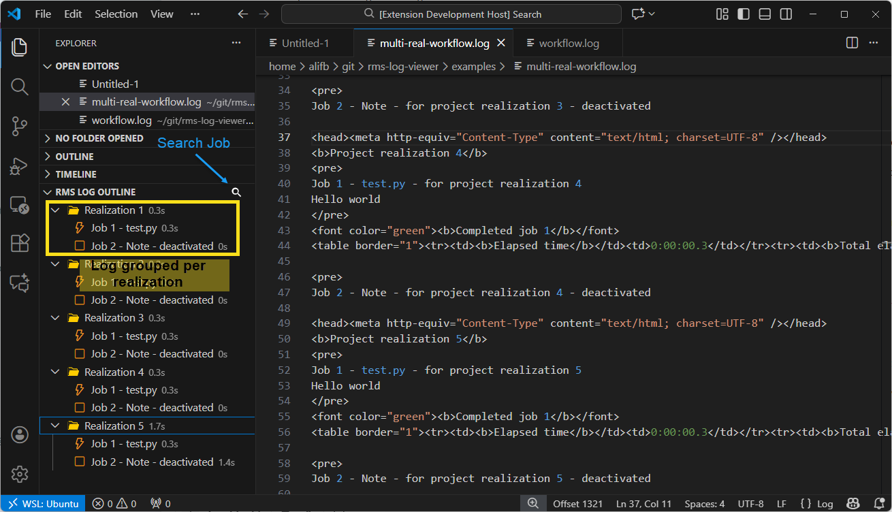
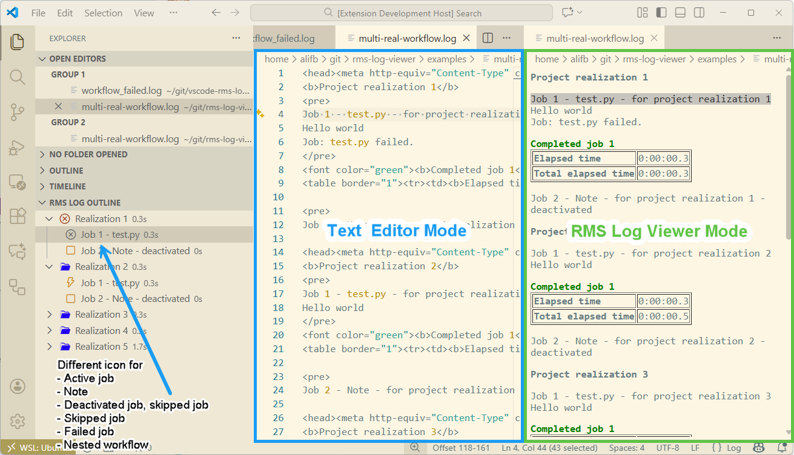

# RMS Log Outline plugin for VSCode

Display outline of workflow log file generated by RMS when running workflow.



## Features

- Show RMS log viewer in outline view
- RMS Log viewer mode (Use "Reopened Editor With ...")
- Identify failed job
- Show elapsed time
- Navigate to the job log
- Support multiple realization
- Search job by title



## Extension Settings

Additional settings added by this extension:

- `rms_log_outline.folderIconLight`: Hex color used to fill the folder-style parent icon in the light theme. Default: `#2100f4`.
- `rms_log_outline.folderIconDark`: Hex color used to fill the folder-style parent icon in the dark theme. Default: `#ffcc00`.

Example (in your user or workspace `settings.json`):

```json
{
	"rms_log_outline.folderIconLight": "#2100f4",
	"rms_log_outline.folderIconDark": "#ffcc00"
}
```

Changing these settings will immediately refresh the tree view icons.

## Release Notes

### 0.0.1

Initial release of RMS Log outline

